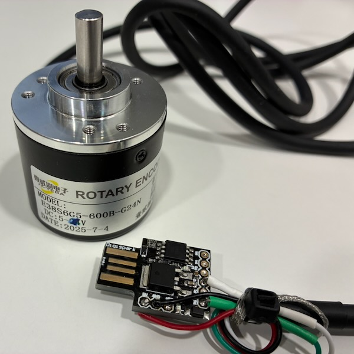

# Digispark ATtiny85 Rotary Encoder USB HID

A simple USB HID rotary encoder based on the **Digispark ATtiny85**.

The project uses an optical incremental rotary encoder with quadrature A/B outputs. The Digispark decodes the encoder and presents the result to the computer as USB mouse-wheel events.

The code was developed and tested with a Digispark ATtiny85 and an E38S6G5-600B-G24N optical rotary encoder with NPN open-collector outputs.



## Hardware

* Digispark ATtiny85
* Optical incremental rotary encoder
* 5 V supply for the encoder
* 4.7 kΩ pull-up resistors for encoder A and B
* USB connection to the computer

Example pin assignment:

| Encoder     | Digispark |
| ----------- | --------- |
| A (green)   | D2 / PB2  |
| B (white)   | D0 / PB0  |
| VCC (red)   | +5 V      |
| GND (black) | GND       |

The encoder outputs are **NPN open collector** and must not be connected directly to VCC. The A and B signals are pulled up to 5 V with external resistors.

## Arduino / Digispark software

The project was developed using **Arduino IDE 1.8.19** and the Digistump AVR board support.

The original Digistump Arduino core is old and is no longer actively maintained. It is nevertheless used here because it provides the Digispark board support and Micronucleus USB bootloader integration required by the original Digispark boards.

### Installing Digispark support

In Arduino IDE, open:

**Arduino → Preferences → Additional Boards Manager URLs**

Add the following URL:

```text
https://raw.githubusercontent.com/digistump/arduino-boards-index/master/package_digistump_index.json
```

Then open:

**Tools → Board → Boards Manager...**

Search for **Digistump AVR Boards** and install it.

Select:

```text
Digispark (Default - 16.5mhz)
```

under:

**Tools → Board → Digistump AVR Boards**

## Uploading the sketch

The Digispark uses the **Micronucleus** bootloader rather than a conventional serial bootloader.

Start the upload in Arduino IDE with the Digispark disconnected. When the IDE reports:

```text
Plug in device now...
```

connect the Digispark.

On some systems, the old Micronucleus uploader can occasionally fail during the flash erase operation with:

```text
Flash erase error -32
```

If this happens, disconnect the Digispark and retry the upload. During testing, the upload sometimes required several attempts before succeeding.

## Rotary encoder

The encoder uses quadrature A/B signals. The current implementation uses the A signal to generate an interrupt and samples B to determine the direction of rotation.

The code currently uses 2× quadrature decoding. The number of encoder counts required to generate one mouse-wheel step can be adjusted in the source code.

## Acknowledgements

The initial implementation of the rotary encoder decoding and USB HID mouse-wheel functionality was developed with assistance from OpenAI's ChatGPT. The code was subsequently reviewed, tested on the hardware, and adapted for this project.

## License

Copyright (C) 2026 PA3BYA.

Licensed under the [GNU General Public License, version 3 or later](LICENSE).